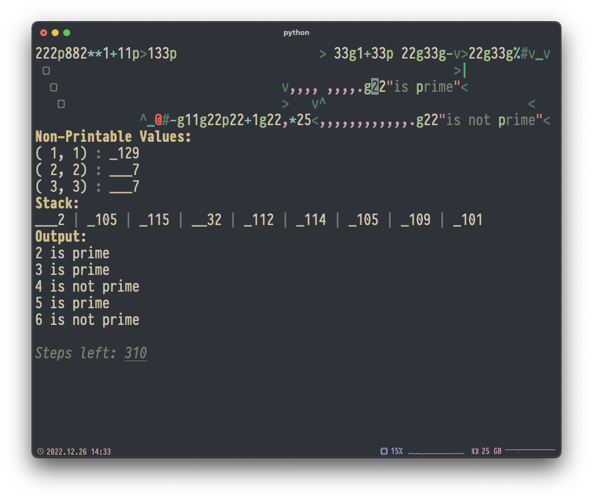

# befunge-sql

_A Befunge-93 Interpreter written in SQL._

> This is a project for the [SQL is a Programming Language Seminar](https://db.cs.uni-tuebingen.de/teaching/ws2223/sql-is-a-programming-language/) during the winter semester 22/23 at the University of Tübingen.

This project implements an interpreter for the esoteric programming language [Befunge-93](https://esolangs.org/wiki/Befunge)—specifically, it implements the interpreter in SQL. The project also implements a Python-based frontend to enable easier interaction with the interpreter.


## Befunge-93 Intro

> Befunge is a two-dimensional esoteric programming language invented in 1993 by Chris Pressey with the goal of being as difficult to compile as possible. Code is laid out on a two-dimensional grid of instructions, and execution can proceed in any direction of that grid.[^0]

**Example: Calculate Prime Numbers**

```
222p882**1+11p>133p                    >33g1+33p 22g33g-v>22g33g%#v_v
 o                                                      >|
  2                              v,,,,, ,,,.g22"is prime"<
   1                             >   v ^                           <
              ^_@#-g11g22p22+1g22,*25<,,,,,,,,,,,,.g22"is not prime"<
```

## SQL-based Interpreter

For the uninitiated: SQL is Turing complete since the introduction of recursive common table expressions (CTEs) in the SQL:1999 standard[^1]. In theory, this enables you to implement any “reasonable” computation in SQL. However, you must express the computations control flow through a fixed-point combinator. The easiest way to achieve this is to transform a program into trampolined style[^2]. I.e., a set of three functions `init`, `step`, and `trampoline`, where `init` produces some initial program state, `step` takes a program state and produces another, and `trampoline` represents the fixed-point combinator for the `step` function. In SQL, `init` and `step` correspond to the initial and recursive subqueries of recursive CTE, whereas `trampoline`, on the other hand, is already encoded in the semantics of recursive CTEs.

The Befunge interpreter implemented in this project uses such a recursive query to run Befunge programs. Obviously, this requires that the DBMS you run the interpreter on supports recursive CTEs. Aside from recursive CTEs, the DBMS also needs to support arrays, enums, Unicode strings, UDFs, and default arguments for UDFs. This interpreter is developed on PostgreSQL 15[^3] and tested on older versions down to PostgreSQL 11[^4].

The core of the interpreter is implemented in the UDF named `befunge`. The UDF takes a Befunge program as an input and produces a program trace. Befunge programs can usually interact with standard IO—i.e., can read from `stdin` and write to `stdout`. Since this isn't possible in SQL the `stdin`-content can be supplied to the `befunge` UDF via the `inp` parameter. Other parameters include the `width` and `height` of the program—limiting these can speedup programs that make use of edge-wrapping significantly.

## Python-based Frontend

Though the interpreter's output is _relatively readable_, using it is tricky. To make things easier, this project also includes a Python-based frontend, which also includes a stepper that visualizes the execution of Befunge programs better than any DBMS query result pager could. The frontend is implemented in Python 3.11[^5] and uses Pipenv[^6] for dependency management. To use it, install those two, then run `pipenv install` to install the remainder of the dependencies, and finally, run `pipenv run python befunge.py path/to/my/befunge/program.toml`.



The input files—i.e., the `path/to/my/befunge/program.toml` from before—use TOML[^7] to encode all parameters the `befunge` UDF in the backend requires. In its simplest form, this only includes a program's source code but can also be enriched with the `width` and `height` fields described before. If your program takes user input, you must also add the input to the TOML file.

[^0]: https://esolangs.org/wiki/Befunge
[^1]: https://en.wikipedia.org/wiki/Hierarchical_and_recursive_queries_in_SQL
[^2]: Steven E. Ganz, Daniel P. Friedman, and Mitchell Wand. 1999. Trampolined style. SIGPLAN Not. 34, 9 (Sept. 1999), 18–27. https://doi.org/10.1145/317765.317779
[^3]: https://www.postgresql.org/docs/15/index.html
[^4]: https://www.postgresql.org/docs/11/index.html
[^5]: https://docs.python.org/3.11/
[^6]: https://pipenv.pypa.io
[^7]: https://toml.io/en/